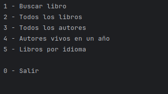

# LiterAlura Application

## Descripción

La aplicación **LiterALura** es una solución que permite gestionar libros y autores mediante una base de datos conectada con **PostgreSQL**. La aplicación también consume la API pública de **GutenDex** para buscar libros, y si no están registrados en la base de datos, los guarda automáticamente.  

La base de datos está diseñada con dos tablas principales relacionadas:  
- **Libros**: Contienen la información principal de los libros.  
- **Autores**: Un libro puede tener múltiples autores, y cada autor puede estar asociado a varios libros.  

La aplicación utiliza **Jackson** para la manipulación de objetos JSON y se conecta a **PostgreSQL** utilizando los controladores de Maven.

---

## Tecnologías utilizadas

- **Java**  
- **Spring Boot**  
- **PostgreSQL** (Conexión vía drivers de Maven)  
- **Jackson** (Para manejo de JSON)  
- **API GutenDex** (Para buscar información de libros)

---

## Configuración de la base de datos

La base de datos tiene dos tablas principales:  

### **Tabla `books`**  
| Campo       | Tipo        | Descripción                                |
|-------------|-------------|--------------------------------------------|
| `id`        | `Long`      | Identificador único del libro.            |
| `title`     | `String`    | Título del libro.                         |
| `language`  | `String`    | Idioma del libro.                         |
| `published` | `Integer`   | Año de publicación.                       |

### **Tabla `authors`**  
| Campo       | Tipo        | Descripción                                |
|-------------|-------------|--------------------------------------------|
| `id`        | `Long`      | Identificador único del autor.            |
| `name`      | `String`    | Nombre completo del autor.                |

### Relación  
- Un libro puede tener **varios autores**.  
- Un autor puede estar asociado con **varios libros**.  
Esta relación es gestionada con una tabla intermedia en la base de datos.

---

## Dependencias principales en Maven

```xml
<dependencies>
    <!-- PostgreSQL Driver -->
    <dependency>
        <groupId>org.postgresql</groupId>
        <artifactId>postgresql</artifactId>
        <version>42.6.0</version>
    </dependency>

    <!-- Jackson -->
    <dependency>
        <groupId>com.fasterxml.jackson.core</groupId>
        <artifactId>jackson-databind</artifactId>
        <version>2.15.0</version>
    </dependency>

    <!-- Spring Boot -->
    <dependency>
        <groupId>org.springframework.boot</groupId>
        <artifactId>spring-boot-starter</artifactId>
    </dependency>
</dependencies>

## Funcionamiento de la App
### Menu inicial :

### Menu inicial :

